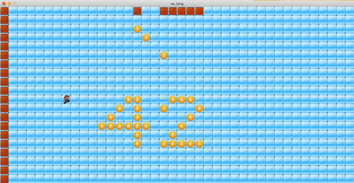

<div align="center">
  
  <h1>so_long</h1>
</div>
<div id=body align="center">
  
</div>

#### What is so_long?
so_long is a graphical project using <i>MiniLibX</i> library. The program uses valid maps to create a 2D game.
The theme of my project is super Mario, the collectable where replaced by bitcoins.<br>
This project is an introduction to game development elements such as tiles, walls, collectables, maps ...etc. 
#### Usage
```bash
clone https://github.com/djedd1ne/so_long.git
```
```bash
cd so_long
```
```bash
make
```
Choose one of the valid maps in the maps folder, do not include the path. Invalid maps are provided for testing during the evaluation.
```bash
./so_long <map_name>
```
